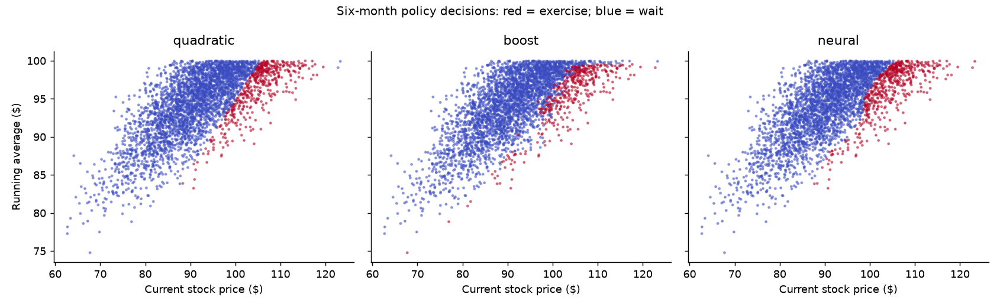
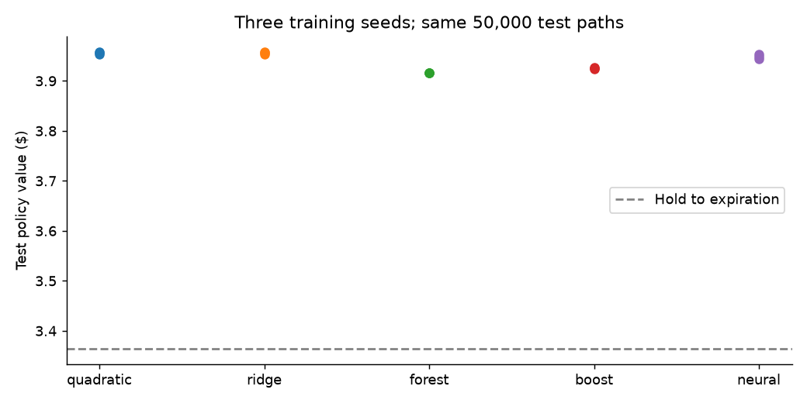
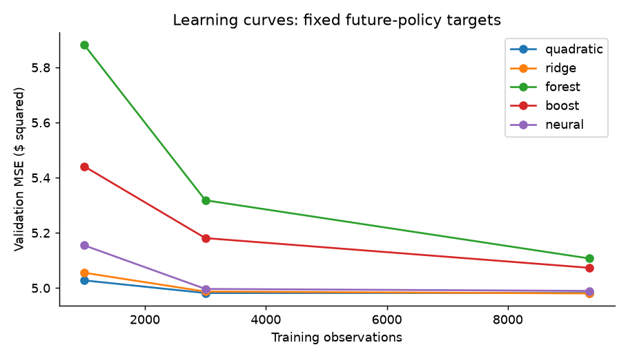
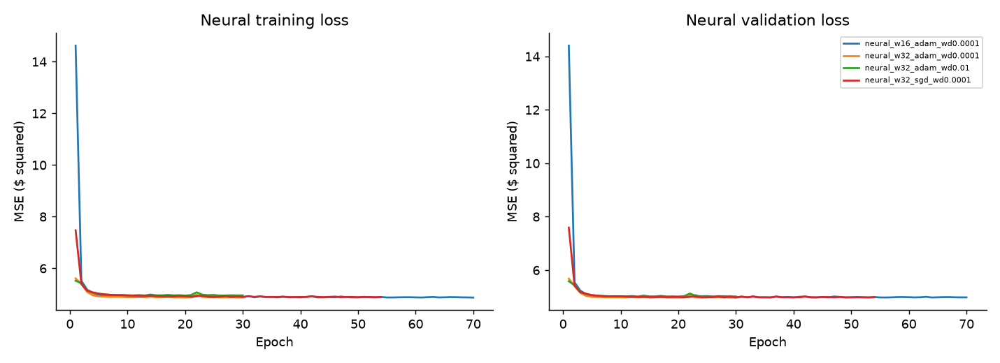
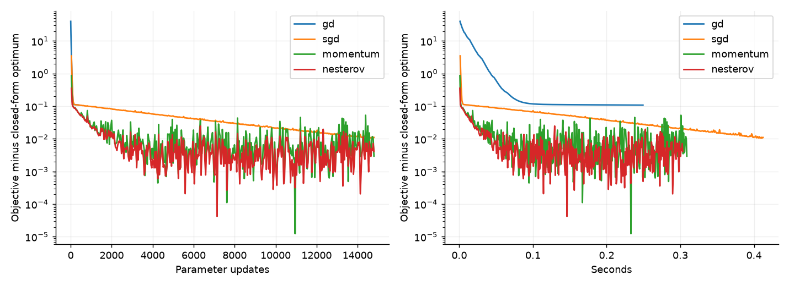

# Learning Exercise Policies for Bermudan Asian Options

**Can a more sophisticated machine learning model make better
early exercise decisions, or does choosing the right financial state
matter more?**

This project studies that question for a Bermudan arithmetic-average
Asian put. I built the full experiment from simulation and
Longstaff--Schwartz regression through tree ensembles and a PyTorch
neural network, then evaluated the resulting exercise policies on
held-out Monte Carlo paths.

The main result was not the one I initially expected: **better state
representation mattered much more than adding model complexity.**

## Main result

A policy that saw only the running average was missing information that
mattered for the future evolution of the option. Adding the current
stock price increased the estimated policy value by about **$0.59 per
option unit**.

  Quadratic policy input | Estimated policy value
  |---|---|
  Running average only | $3.3632
  Current stock price + running average | $3.9531

The paired gain was **$0.5899**, with a 95% confidence interval of
**[$0.5739, $0.6058]**.

By comparison, replacing quadratic regression with more flexible models
did not reliably improve under the tested training setup.

### Exercise-policy decision regions



*Each point represents the state of one simulated option halfway to expiration. The x-axis is the current stock price, and the y-axis is the running average price, the two variables the models use to decide whether to exercise. Red points are states where the learned policy exercises the option; blue points are states where it waits. The boundary between the colors is therefore the model's learned exercise boundary. Despite using very different model classes, quadratic regression, gradient boosting, and the neural network learn broadly similar decision regions.*

## What I tested

At each exercise date, the policy has to answer a simple-looking
question:

> Is the payoff from exercising now larger than the estimated value of
> keeping the option alive?

The immediate exercise payoff is known. The difficult part is the
**continuation value**, because it depends on future prices and future
exercise decisions.

I used Longstaff Schwartz as the basic framework and changed the model
used to estimate continuation value:

  | Model | Why I included it |
  |---|---|
  | Quadratic regression | Simple Longstaff–Schwartz baseline |
  | Cubic ridge regression | More flexible polynomial with regularization |
  | Random forest | Nonlinear tree-based model |
  | Gradient boosting | Sequential tree ensemble |
  | Neural network | Flexible learned nonlinear representation |

All selected policies were evaluated on the same 50,000 unseen
simulation paths so we could compare payoffs path by path.

## What happened

Across three training seeds, quadratic and ridge regression were
essentially tied. The neural network was close, while the selected
forest and boosting policies were lower.

  Model | Mean policy value across 3 training seeds
  |---|---|
  Quadratic regression | $3.9561
  Cubic ridge regression | $3.9560
  Neural network | $3.9482
  Gradient boosting | $3.9290
  Random forest | $3.9163

### Policy value across training seeds



*This figure compares the value produced by each learned exercise policy on the same 50,000 unseen simulated paths. Each point represents a policy trained with a different random seed, while the dashed line shows the value obtained by simply holding the option to expiration. Higher values indicate better exercise decisions. Quadratic regression, ridge regression, and the neural network produce very similar policy values, while the tree-based models are somewhat lower. The small spread within each model also shows that the result is relatively stable across the three training seeds tested.*

The main result is not that the most complex model wins: a simple quadratic continuation model performs essentially as well as the neural network under this experimental setup.

## Why spot price matters

For an Asian put, the immediate payoff depends on the running average

$$
A_t = \frac{S_0 + S_1 + \cdots + S_t}{t+1},
$$

and exercising pays

$$
\max(K - A_t, 0).
$$

It is tempting to use only $A_t$ as the model input because it

It is tempting to use only $$A_t$$ as the model input because it
determines today's payoff. But two paths can have the same running
average and very different current stock prices.

For example:

  -----------------------------------------------------------------------
      Current stock price         Running average   Immediate payoff when
                                                                  (K=100)
  ----------------------- ----------------------- -----------------------
                      $80                     $95                      $5

                     $110                     $95                      $5
  -----------------------------------------------------------------------

The immediate payoff is identical, but the states are not equivalent.
The current stock price affects where the running average may move next,
so it contains information about the value of waiting.

That motivated the feature-ablation experiment comparing $$A_t$$ with the
fuller state $$(S_t,A_t)$$.

## Longstaff Schwartz policy

The exercise policy is trained backward through time.

1.  At expiration, each path receives its terminal payoff.
2.  At the previous exercise date, the later discounted payoff becomes a
    target for the value of waiting.
3.  A model predicts continuation value from the current state.
4.  The policy exercises when immediate payoff exceeds predicted
    continuation value.
5.  The procedure moves backward to the previous exercise date and
    repeats.

The quadratic baseline uses normalized spot and average,

$$
s = \frac{S_t}{K}, \qquad a = \frac{A_t}{K}
$$

with features

$$ \[1, s, a, s^2, sa, a^2\]. $$

After training, the policy is frozen and run **forward** on new paths.
Exercise decisions use only information available at the current date.

## Controlled ML comparison

Full policy value is the quantity I ultimately care about, but it is not
a clean supervised-learning metric because changing an exercise decision
changes the future payoff target.

To separate prediction quality from policy quality, I also built a
fixed-target experiment at date 25. Every model receives the same state
$$(S_t,A_t)$$ and predicts the same realized future-policy payoff
generated by an independent quadratic teacher policy.

  Model | Validation MSE | Test MSE
  |--|--|--|
  Quadratic | 4.9821 | 4.9609
  Ridge | 4.9804 | 4.9605
  Random forest | 5.1073 | 5.1258
  Gradient boosting | 5.0747 | 5.0756
  Neural network | 4.9765 | 4.9705

### Learning curves



*This plot asks how much additional training data helps each model predict future policy payoffs. The x-axis shows the number of training observations and the y-axis shows validation mean-squared error, so lower is better. Random forests and gradient boosting improve substantially as more data are added, while quadratic regression, ridge regression, and the neural network reach similar error levels relatively quickly. This suggests that, for this continuation-value prediction task, additional model complexity does not automatically translate into better out-of-sample prediction.*

An important lesson from this experiment is that **prediction error and
policy value are not the same objective**. A small continuation-value
error near the exercise boundary can flip a decision, while a larger
error far from the boundary may have no effect on the policy.


## Neural-network experiment

The neural continuation model is a small PyTorch network with two
inputs, two hidden layers, ReLU activations, and one continuation-value
output.

I implemented:

-   train-only feature standardization;
-   explicit mini-batch training;
-   validation-based early stopping;
-   optimizer and regularization comparisons;
-   learning curves;
-   backward training of a separate model at each intermediate exercise
    date.

### Neural-network training



*Training and validation MSE are shown across epochs for the neural-network configurations considered during model selection. Both losses fall sharply during the first few epochs and then flatten near the same level. The close agreement between training and validation loss provides little evidence of severe overfitting in these runs, while the similar final losses show that increasing width or changing the optimizer produced only modest differences for this task.*
The network was competitive with the regression baseline, but its
additional flexibility did not translate into a reliable policy-value
improvement in this experiment.

## Optimization from scratch

I also implemented four optimizers manually for a regularized
continuation-regression problem:

-   batch gradient descent;
-   mini-batch SGD;
-   momentum;
-   Nesterov accelerated gradient.

The implementations were checked against an analytic gradient and a
closed-form ridge solution.

  | Method | Final objective | Gap to closed-form optimum | Updates |
  |---|---:|---:|---:|
  | GD | 2.647239 | 0.108052 | 400 |
  | SGD | 2.550227 | 0.011040 | 14,800 |
  | Momentum | 2.542132 | 0.002945 | 14,800 |
  | Nesterov | 2.543284 | 0.004097 | 14,800 |
  
### Optimization from scratch



*To examine the optimization step directly, I implemented gradient descent, stochastic gradient descent, momentum, and Nesterov momentum from scratch for the same regularized continuation-value regression problem. The y-axis measures how far each optimizer's objective remains above the analytically computed closed-form minimum, so values closer to zero indicate better convergence. The left panel measures progress by parameter updates, while the right measures progress by wall-clock time.*

*Full-batch gradient descent makes smooth but relatively slow progress. Mini-batch SGD gets much closer to the optimum, while momentum and Nesterov reach the smallest gaps within the fixed training budget. Their noisier curves are expected because each update uses only a mini-batch rather than the full dataset. This experiment is about optimization behavior, not which optimizer ultimately produces the best option policy.*

This part is intentionally separate from the full policy comparison. Its
purpose is to inspect the optimization problem behind continuation-value
regression rather than claim that one optimizer produces the best option
policy.

## Experimental setup

The base experiment uses risk-neutral geometric Brownian motion.

  | Parameter | Value |
  |---|---:|
  | Initial stock price | $100 |
  | Strike | $100 |
  | Risk-free rate | 5% |
  | Volatility | 20% |
  | Maturity | 1 year |
  | Future exercise dates | 50 |
  | Training paths per model | 20,000 |
  | Validation paths | 50,000 |
  | Final policy-test paths | 50,000 |

The Asian average includes the initial stock price. Exercise is allowed
only at the scheduled dates, so the contract is Bermudan rather than
fully American.

The project uses simulated prices rather than historical market data. It
is an option-pricing and optimal-stopping experiment, **not a
stock-price forecasting or trading-signal system**.

## Keeping the experiment honest

I separated the simulation samples by purpose:

| Data | Purpose |
|---|---|
| Training paths | Fit model parameters |
| Validation paths | Choose among predefined configurations |
| Teacher-policy paths | Construct common targets for the controlled prediction task |
| Final test paths | Evaluate frozen policies |

The main policy comparison also uses three training seeds to check
whether the conclusions depend heavily on one training sample.

For paired policy comparisons, the same test paths are used for both
policies. If $$P_i\^A$$ and $$P_i\^B$$ are their discounted payoffs on path
$$i$$, I analyze

$$D_i=P_i^A-P_i^B $$

and report a confidence interval for the mean paired difference.

## Financial sanity checks

Before extending the project to the path-dependent Asian contract, I
kept simpler ordinary-put implementations as numerical controls:

-   Black--Scholes European put pricing;
-   European Monte Carlo pricing;
-   Cox--Ross--Rubinstein binomial trees;
-   ordinary-put Longstaff--Schwartz.

These give familiar numerical references for checking the simulation,
discounting, and exercise machinery before relying on the harder
Asian-option experiment.

## Repository structure

  -----------------------------------------------------------------------
  Location                            Purpose
  ----------------------------------- -----------------------------------
  `src/simulation.py`                 Simulates stock-price paths

  `src/asians_payoff.py`              Computes running averages and Asian
                                      payoffs

  `src/asian_lsm.py`                  Quadratic Asian Longstaff--Schwartz
                                      policy

  `src/continuation_dataset.py`       Common-target dataset and generic
                                      policy evaluation

  `src/optimizers.py`                 Manual optimization algorithms

  `src/ml_models.py`                  Ridge, forest, boosting, and neural
                                      models

  `experiments/compare_ml.py`         Runs the full experiment suite

  `results_ml/`                       Numerical outputs

  `figures_ml/`                       Generated figures

  `archive/`                          Earlier pricing benchmarks and
                                      exploratory scripts

  `RESULTS.md`                        Detailed numerical results and
                                      qualifications
  -----------------------------------------------------------------------

## Reproducing the project

Create or activate the environment and install the dependencies:

``` bash
conda activate quant
cd ~/Desktop/american-option-ml-clean
python -m pip install -r requirements.txt
```

Run the numerical checks:

``` bash
python run.py check
```

Run the full experiment:

``` bash
python run.py full
```

A full run trains the candidate models, performs validation-based
selection, evaluates the frozen policies, and writes CSV files and
figures to a timestamped directory under `runs/`.

Neural-network and boosting results can vary slightly across machines or
package versions. The quadratic baseline, ridge comparison,
feature-ablation result, and overall conclusions should reproduce
closely.

## Limitations

This is a simulation study, so the results depend on the assumed GBM
dynamics, contract parameters, simulated sample sizes, tested
hyperparameter grid, and training budgets.

The exact optimal early-exercise value and decision boundary for this
Asian option are not known here. The reported numbers are estimates of
the values of the **learned policies**, not proof of a globally optimal
policy and not real-market trading profits.

For the complete tables, seed-by-seed comparisons, robustness runs,
controls, and statistical qualifications, see
[`RESULTS.md`](RESULTS.md).
